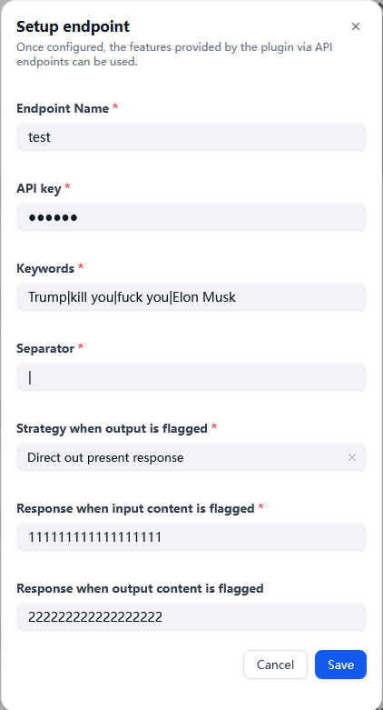
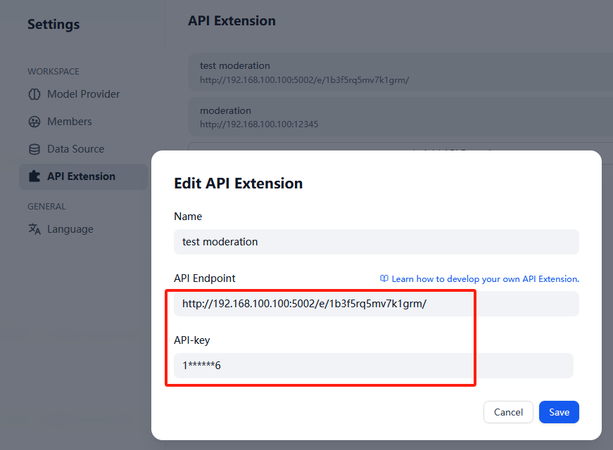
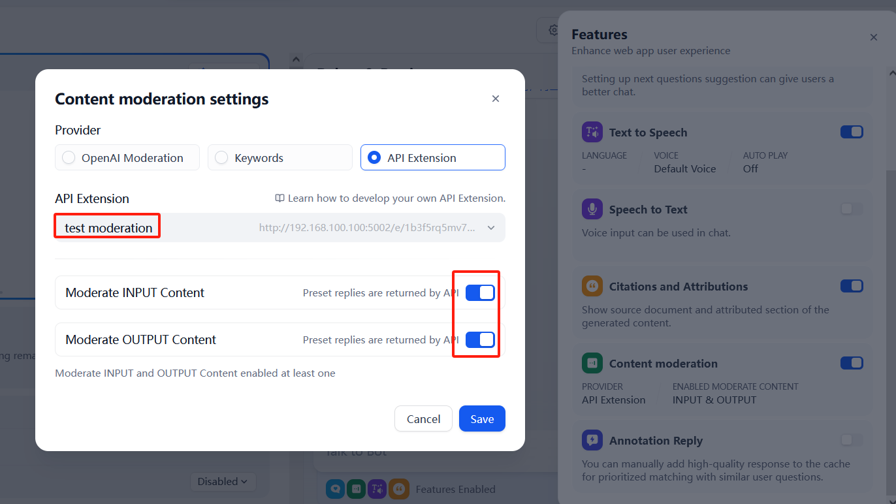
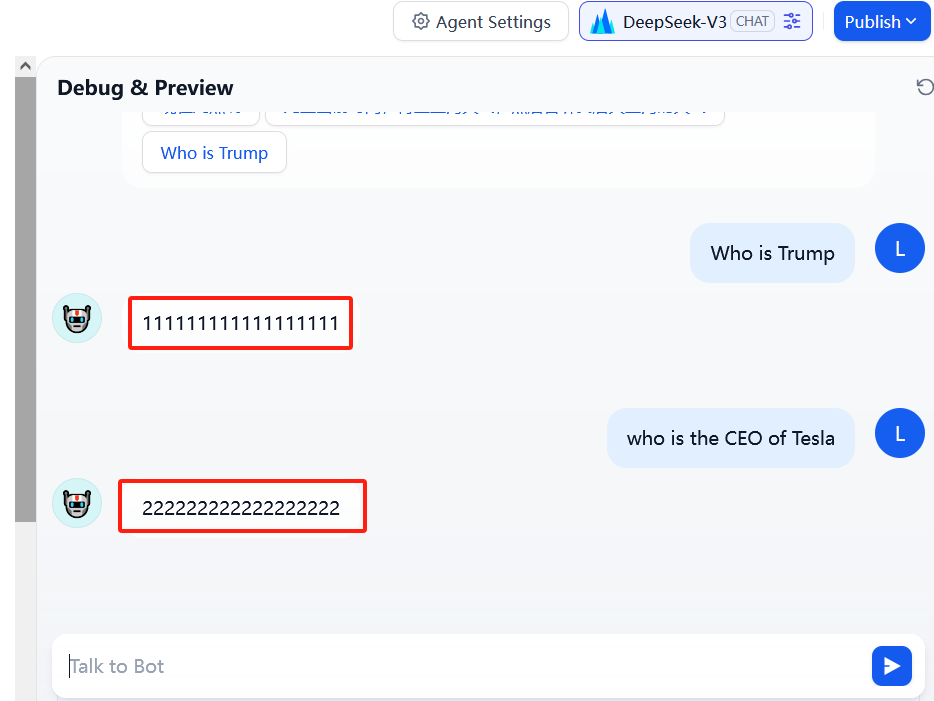
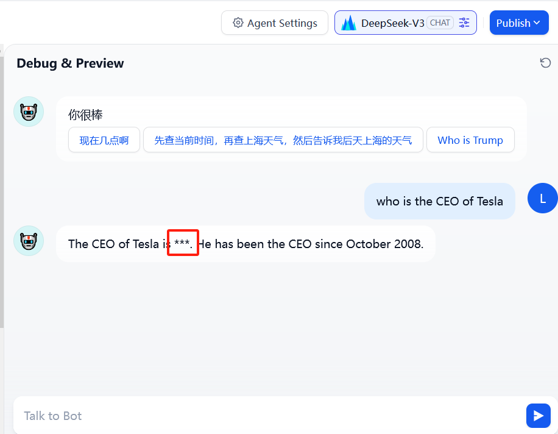

## moderation

**Author:** leslie2046   
**Repository:** https://github.com/leslie2046/moderation_plugin   
**Version:** 0.0.1   
**Type:** extension    

### Overview
You can use this extension plugin to implement an API extension for content moderation, and you can customize keyword lists and separators, as well as strategies for keyword flagged.

## Configuration
### 1. Setup your moderation endpoint

### 2. Add API Extension

_Notes: API KEY and API Endpoint need to be copied from the previous step_

### 3. Enable the Content moderation setting

## Example
- direct_output mode

- overridden mode
