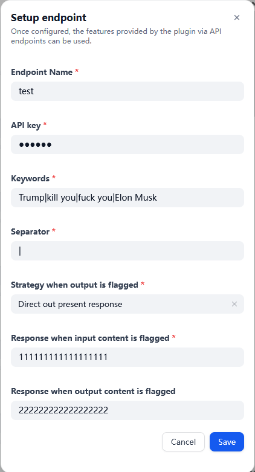
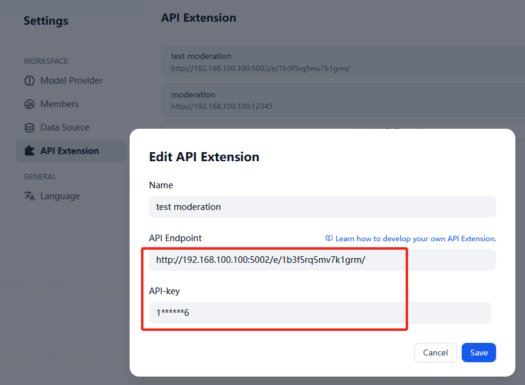
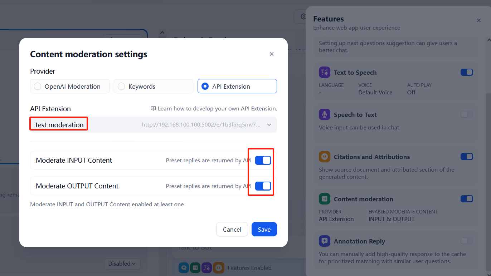
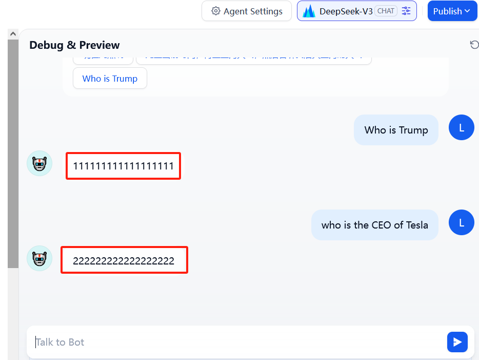
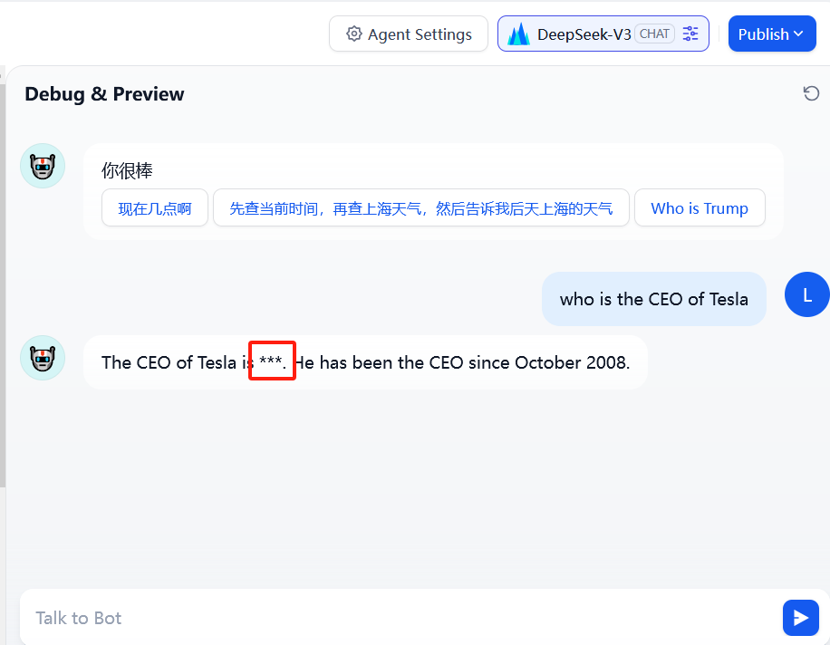

# Moderation Plugin

Keyword-based content moderation extension for Dify.

This plugin exposes a moderation endpoint that Dify can call to inspect both app input and app output. It uses a configurable keyword list, a custom separator, and an API key to decide whether flagged content should be blocked or masked.

## Overview

- **Author:** leslie2046
- **Repository:** https://github.com/leslie2046/moderation_plugin
- **Plugin Version:** 0.0.2
- **Runtime:** Python 3.12
- **Minimum Dify Version:** 0.3.0

## What It Does

- Moderates user input before it reaches the app.
- Moderates model output before it is returned to the user.
- Uses a custom keyword list with a configurable separator.
- Protects the moderation endpoint with a Bearer API key.
- Supports two output handling modes:
  - `direct_output`: return a preset response immediately.
  - `overridden`: replace matched keywords with `***`.

> Note: the current plugin settings expose `output_strategy`. When input content is flagged, the plugin returns the configured input preset response.

## Moderation Flow

| Stage | What happens when a keyword is matched |
| --- | --- |
| Input moderation | The plugin checks `inputs` and `query`. If flagged, it returns the configured input preset response. |
| Output moderation | The plugin checks generated `text`. If flagged, it either returns the preset response or masks keywords with `***`, depending on `output_strategy`. |

## Configure in Dify

### 1. Set up the moderation endpoint



### 2. Add the API Extension



_Copy the `API KEY` and `API Endpoint` from the previous step._

### 3. Enable content moderation



## Configuration Reference

| Setting | Required | Description |
| --- | --- | --- |
| `api_key` | Yes | Bearer token used by Dify when calling the moderation endpoint. |
| `keywords` | Yes | Keywords to detect in input or output content. |
| `separator` | Yes | Character used to split the keyword list. Default is a space. |
| `input_preset_response` | Yes | Response returned when input content is flagged. |
| `output_strategy` | Yes | Output handling mode: `direct_output` or `overridden`. |
| `output_preset_response` | No | Response returned when output content is flagged in `direct_output` mode. |

## Examples

### `direct_output`



### `overridden`



## Local Development

### Install dependencies

```bash
pip install -r requirements.txt
```

### Configure debug environment

Create a `.env` file based on `.env.example`:

```env
INSTALL_METHOD=remote
REMOTE_INSTALL_URL=debug.dify.ai:5003
REMOTE_INSTALL_KEY=********-****-****-****-************
```

### Run the plugin

```bash
python -m main
```

## Privacy

This plugin does not collect user data. See [PRIVACY.md](./PRIVACY.md) for details.

## License

See [LICENSE](./LICENSE).
