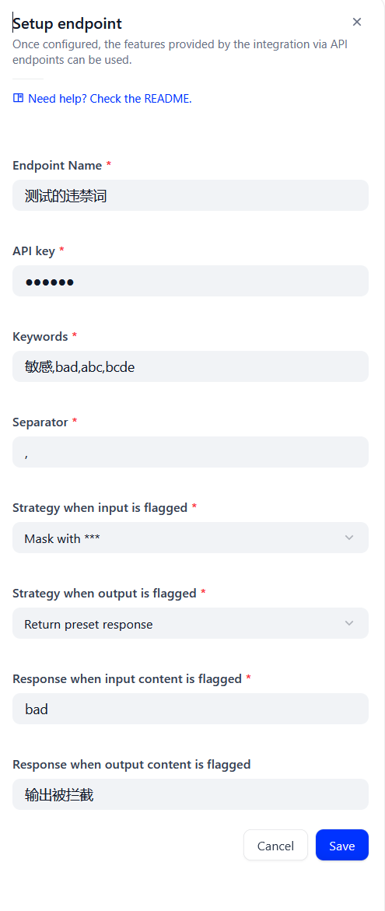
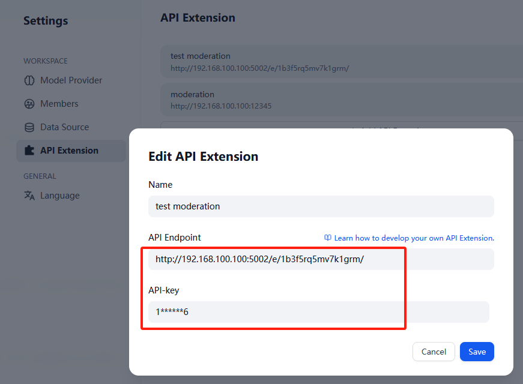
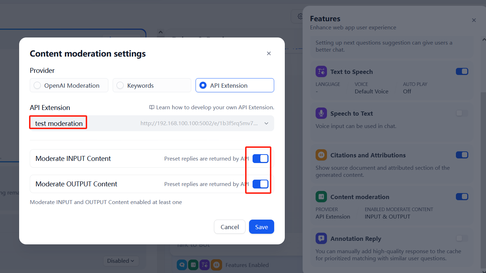
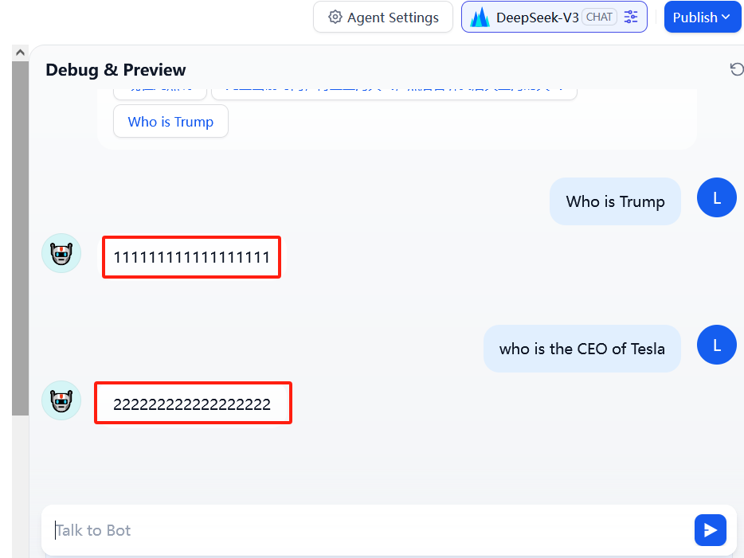
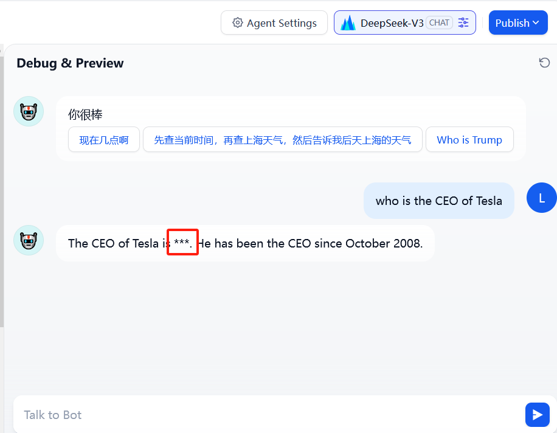

# Moderation Plugin

Keyword-based content moderation extension for Dify.

This plugin exposes a moderation endpoint that Dify can call to inspect both app input and app output. It uses a configurable keyword list, a custom separator, and an API key to decide whether flagged content should be blocked or masked.

## Overview

- **Author:** leslie2046
- **Repository:** https://github.com/leslie2046/moderation_plugin
- **Plugin Version:** 0.0.3
- **Runtime:** Python 3.12
- **SDK:** `dify_plugin>=0.9.0,<0.10.0`
- **Contact:** 253605712@qq.com
- **Minimum Dify Version:** 0.3.0

## What It Does

- Moderates user input before it reaches the app.
- Moderates model output before it is returned to the user.
- Uses a custom keyword list with a configurable separator.
- Protects the moderation endpoint with a Bearer API key.
- Supports independent input and output handling modes:
  - `direct_output`: return a preset response immediately.
  - `overridden`: replace matched keywords with `***`.

Existing configurations without `input_strategy` retain `direct_output` behavior.

## Moderation Flow

| Stage | What happens when a keyword is matched |
| --- | --- |
| Input moderation | The plugin checks top-level string values in `inputs` and `query`, returning the input preset response or masking matches according to `input_strategy`. Non-string values, including file objects, are preserved and not inspected recursively. |
| Output moderation | The plugin checks generated `text`. If flagged, it either returns the preset response or masks keywords with `***`, depending on `output_strategy`. |

## Configure in Dify

### 1. Set up the moderation endpoint



### 2. Add the API Extension



_Copy the `API KEY` and `API Endpoint` from the previous step._

### 3. Enable content moderation



## Configuration Reference

| Setting | Required | Description |
| --- | --- | --- |
| `api_key` | Yes | Bearer token used by Dify when calling the moderation endpoint. |
| `keywords` | Yes | Keywords to detect in input or output content. |
| `separator` | Yes | Character used to split the keyword list. Default is a space. |
| `input_preset_response` | Yes | Response returned when input content is flagged. |
| `input_strategy` | Yes | Input handling mode: `direct_output` (default) or `overridden`. |
| `output_strategy` | Yes | Output handling mode: `direct_output` or `overridden`. |
| `output_preset_response` | No | Response returned when output content is flagged in `direct_output` mode. |

Matching is literal, case-sensitive substring matching. Keywords are trimmed,
empty entries discarded, and duplicates removed. The separator may contain multiple
characters but cannot be empty. Overlapping keyword occurrences are masked as one
span, independently of keyword order; adjacent occurrences each become `***`.

### Request errors

All responses use JSON. Missing or malformed Bearer credentials return `401`;
an incorrect key returns `403`. Authentication occurs before body parsing, and an
empty configured key cannot authenticate. Malformed JSON, unsupported `point`, and
invalid payload field types return `400`. Invalid moderation configuration returns
`500` rather than silently approving content. Authenticated `ping` returns
`{"result":"pong"}` without requiring moderation settings.

The supported points are `ping`, `app.moderation.input`, and
`app.moderation.output`. `params` must be an object; `inputs` must be an object,
and `query` and `text` must be strings when present. Omitted fields use empty defaults.

## Examples

### `direct_output`



### `overridden`



## Local Development

### Install dependencies

```bash
pip install -r requirements.txt
```

### Configure debug environment

Create a `.env` file based on `.env.example`:

```env
INSTALL_METHOD=remote
REMOTE_INSTALL_URL=debug.dify.ai:5003
REMOTE_INSTALL_KEY=********-****-****-****-************
```

### Run the plugin

```bash
python -m main
```

### Run regression tests

```bash
pip install -r requirements-dev.txt
python -m pytest -q
```

See [CHANGELOG.md](./CHANGELOG.md) for the 0.0.3 release notes.

## Roadmap

The following features are planned and are not available in 0.0.3. The milestones
indicate implementation order rather than fixed release dates; scope may change
based on Dify compatibility and benchmark results.

### 0.0.4+ — Matching performance and rule configuration

- [ ] Evaluate Aho–Corasick multi-keyword matching and compiled-rule caching for
  large keyword lists; benchmark latency and memory against the current matcher.
- [ ] Add configurable overlap resolution and rule precedence. Version 0.0.3
  already merges overlapping matches for masking; configurable policies remain planned.
- [ ] Add optional regular expressions, case-insensitive matching, full-width /
  half-width normalization, and simplified / traditional Chinese normalization.
- [ ] Add allowlists and explicit precedence between allowlist and blocking rules.
- [ ] Support keyword categories with independent actions and preset responses.
- [ ] Support custom masking text.
- [ ] Provide optional diagnostics with matched rule IDs, categories, and original
  text positions, while preserving the existing Dify moderation response contract.

### Later — Multiple detectors and policy engine

- [ ] Separate detection (`Detector`) from decision logic (`Policy`) so keyword,
  regular-expression, and model-based detectors can share configurable policies.
- [ ] Introduce internal `Allow`, `Block`, `Mask`, and `Review` decisions, mapping
  supported decisions to Dify actions and defining an integration for review handling.
- [ ] Add configurable personally identifiable information (PII) rules.
- [ ] Explore streaming moderation across chunk boundaries with request/session
  isolation; verify the required Dify streaming integration before exposing this feature.

### Later — AI moderation, operations, and evaluation

- [ ] Add hybrid rule-based and AI moderation with configurable OpenAI-style APIs
  and self-hosted model backends.
- [ ] Add moderation metrics, including P50/P95/P99 latency and per-rule hit counts.
- [ ] Add a dry-run mode to evaluate rules without changing the returned content.
- [ ] Add versioned rule sets, rollback, change history, and per-business configuration.
- [ ] Build a labeled moderation benchmark reporting Precision, Recall, F1,
  false-block counts, and P95 latency to assess quality and performance together.

### Publishing follow-ups

- [ ] Validate release tags against `manifest.yaml` versions and package filenames.
- [ ] Verify GitHub authentication, fork relationship, PR target, and required
  publishing permissions before building and uploading packages.
- [ ] Generate release notes from the changelog automatically.

The 0.0.3 changes already cover independent input/output strategies, request and
configuration validation, authentication hardening, overlap-safe masking, and
publishing branch consistency with retry handling. See [CHANGELOG.md](./CHANGELOG.md)
for implemented changes.

## Privacy

This plugin processes content locally for moderation without persisting it or sending it to third-party services. See [PRIVACY.md](./PRIVACY.md) for authentication, storage, and logging details.

## License

See [LICENSE](./LICENSE).
